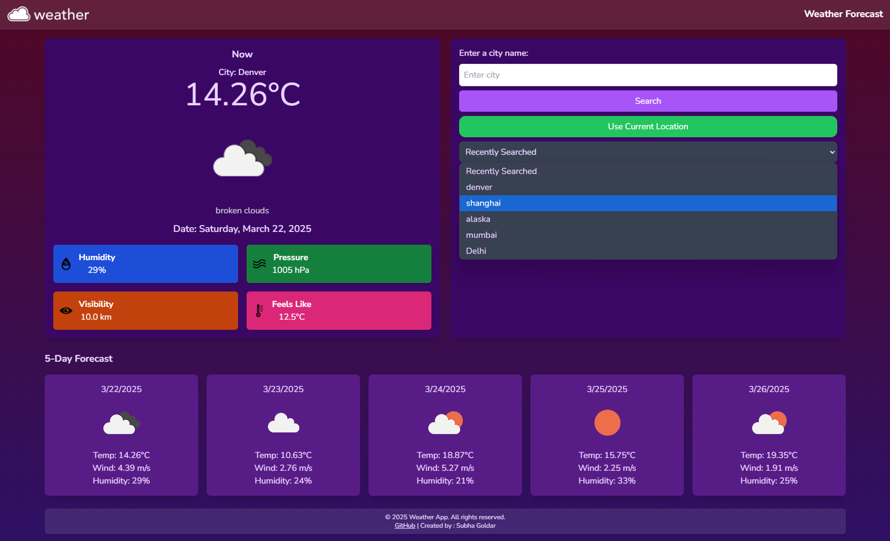
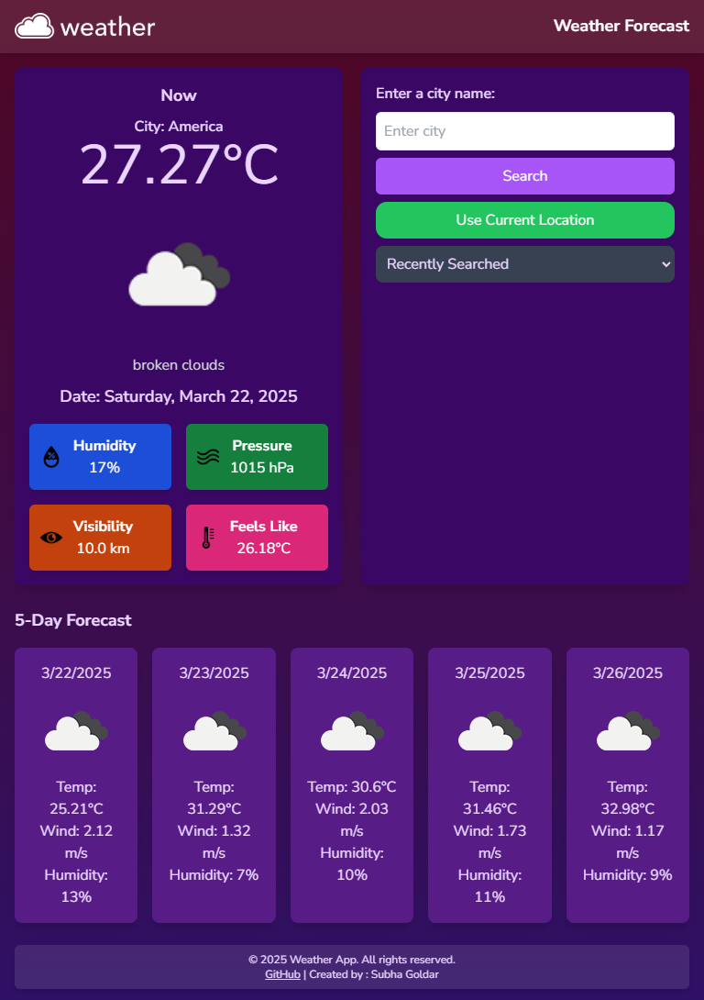
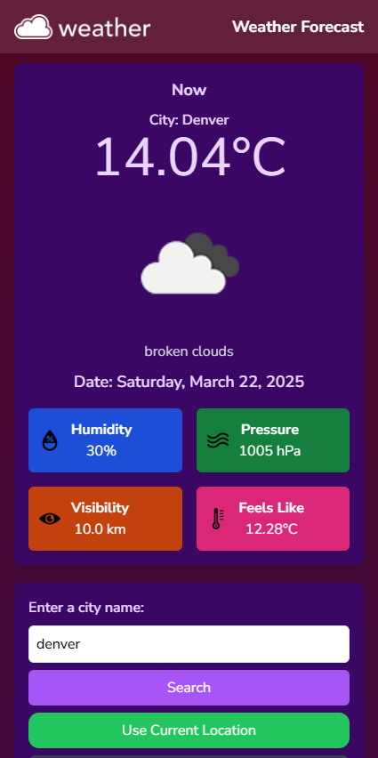
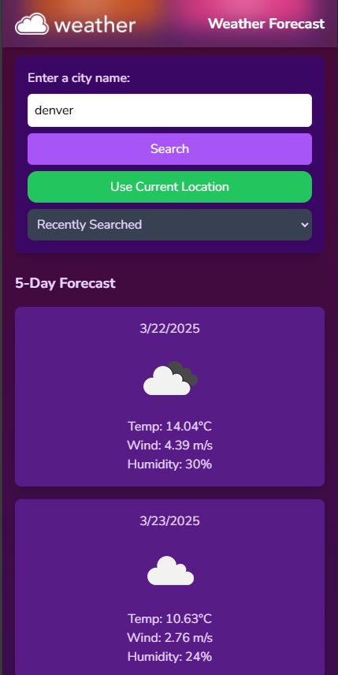

# WeatherApp-v1 🌦️

- 

✨ Author : Subha Goldar ✨

✨Email : Subgold10@gmail.com ✨

✨ A modern and responsive Weather Forecast App built with HTML, Tailwind CSS - CDN mode -, and JavaScript. ✨

- Current Weather Data: Displays temperature, weather conditions, and more.
- Location Search: Get forecasts by entering a city name.
- Current Location Forecast: Fetch weather for your current location using the browser's Geolocation API.
- Location Data Storage: Previous searched locations are preserved in Local Storage.
- 5-Day Forecast: View an extended forecast for the next 5 days.
- Responsive Design: Optimized for desktops, tablets, and smartphones.
- Modern Design: Styled with **Tailwind CSS** and icon images.
- CDN Link - Used **Tailwind CSS** CDN Link- https://cdn.tailwindcss.com , and so no external CSS file , or Tailwind config files are used.

## Technologies Used 🛠️

- **HTML**: The main structure of the Web Page.
- **Tailwind CSS**: For styling and responsiveness.
- **JavaScript**: For dynamic weather data fetching and user interactions.
- **OpenWeatherMap API**: Provides weather data.

## Live Demo 🌦️

- Link : https://subgold10.github.io/WeatherApp-v1/

## SCREENSHOTS ✨

                            

                            
